# 职途智析 — 核心功能模块图

## 系统整体架构模块图

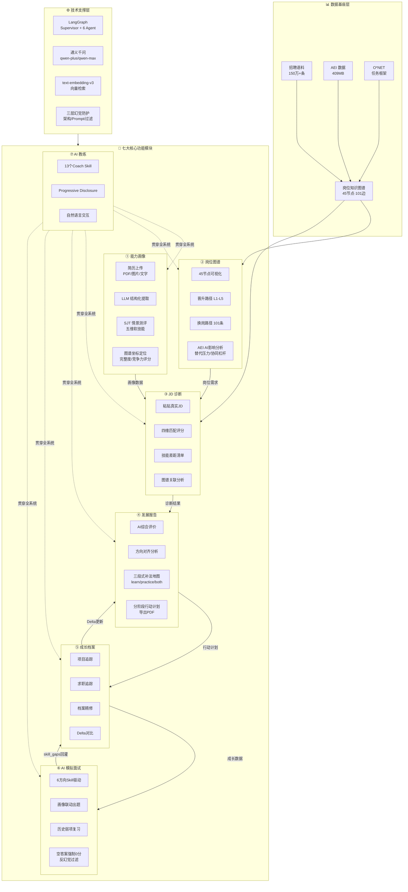

---

## 核心业务闭环

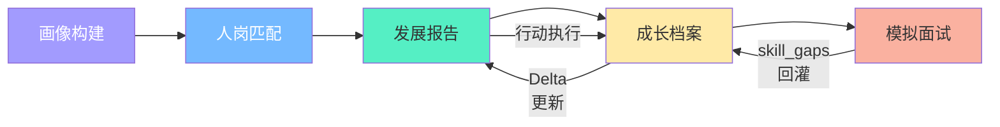

---

## 模块详细拆解

### ① 能力画像模块

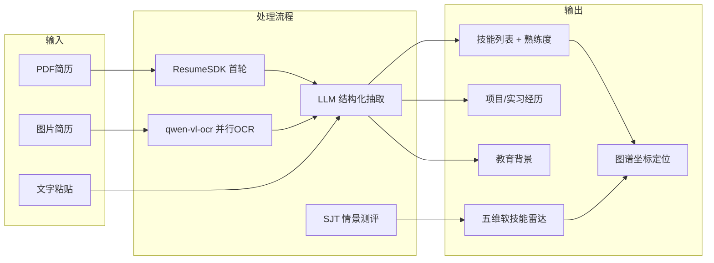

### ② 岗位知识图谱模块

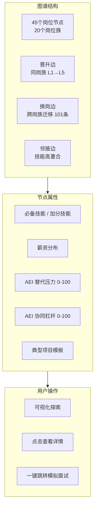

### ③ JD 诊断模块

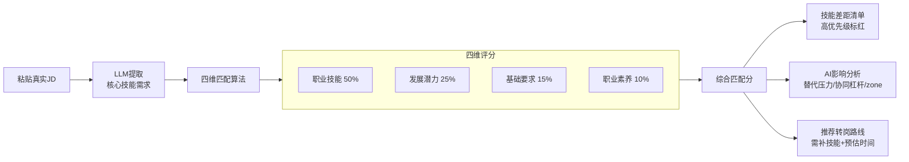

### ④ 发展报告模块

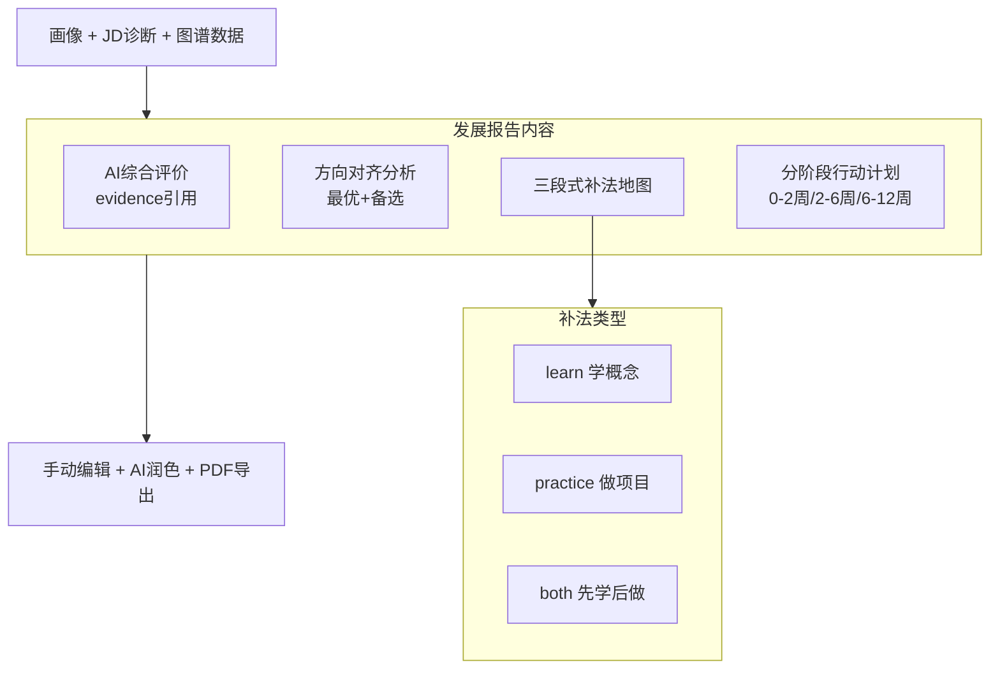

### ⑤ 成长档案模块

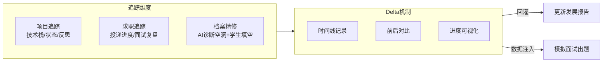

### ⑥ AI 模拟面试模块

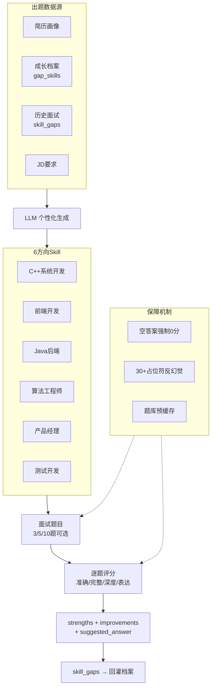

### ⑦ AI 教练模块

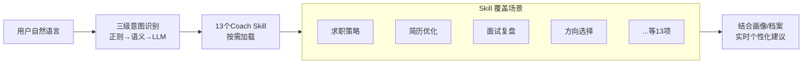

---

## AI Agent 协作体系

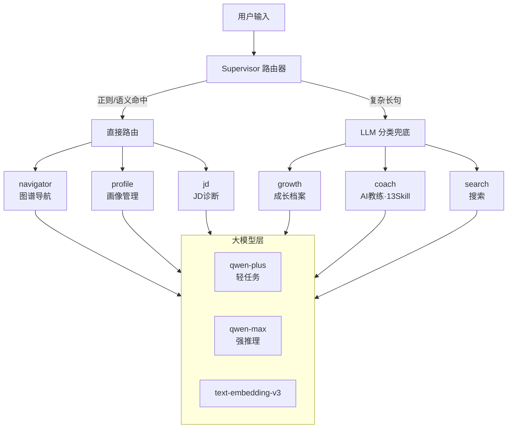

---

## 四层系统架构

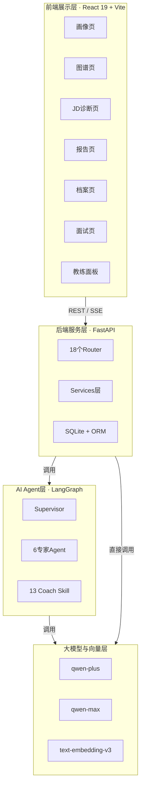
