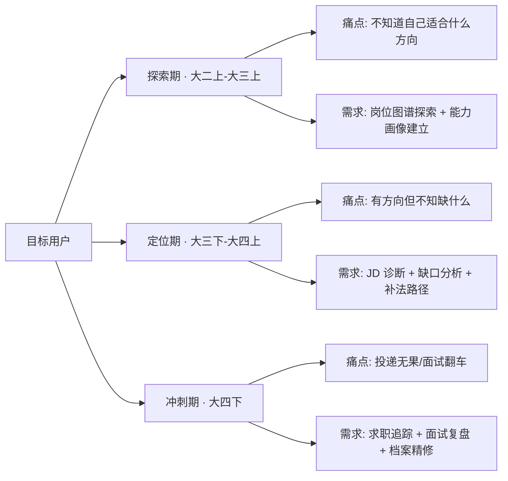
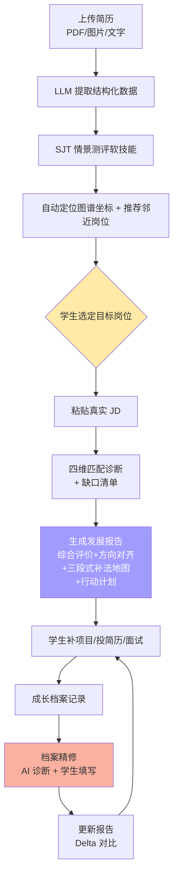
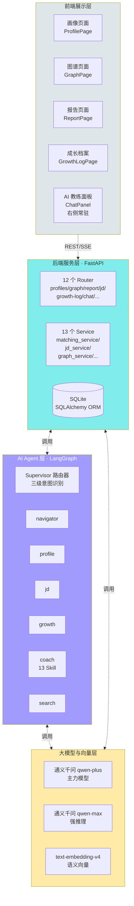
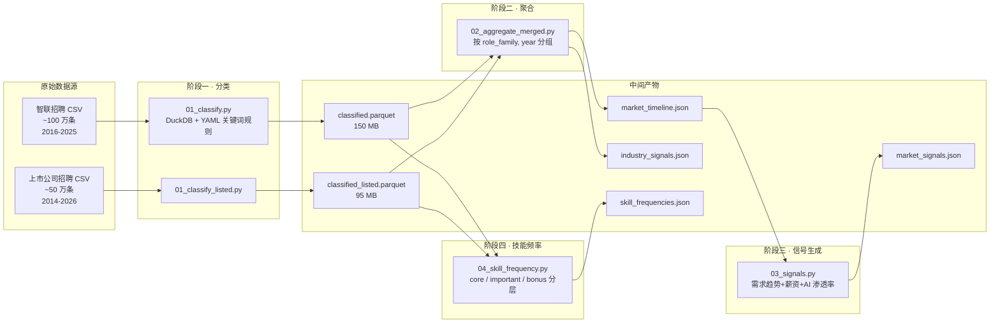
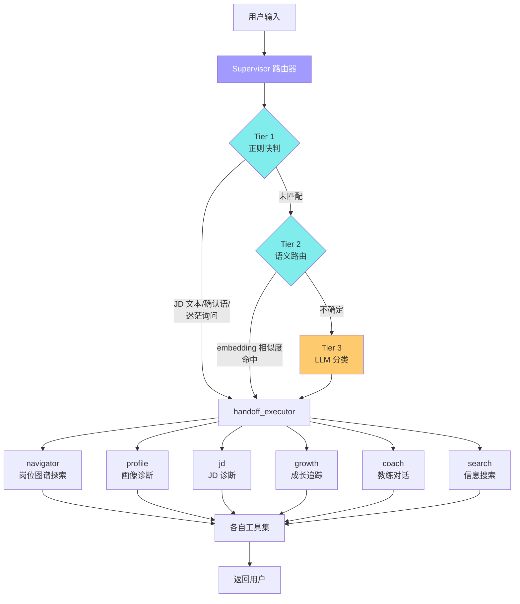
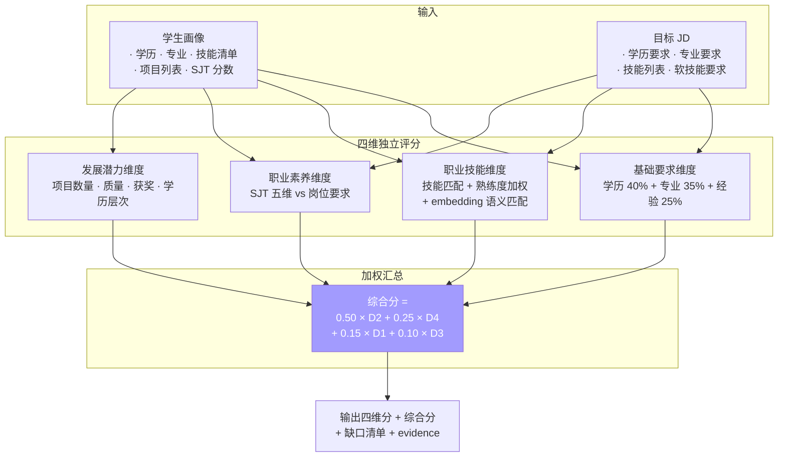
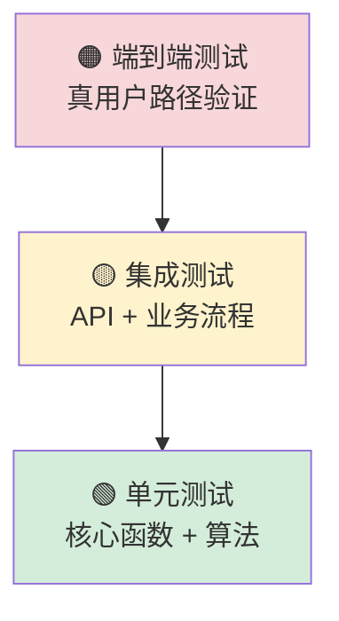
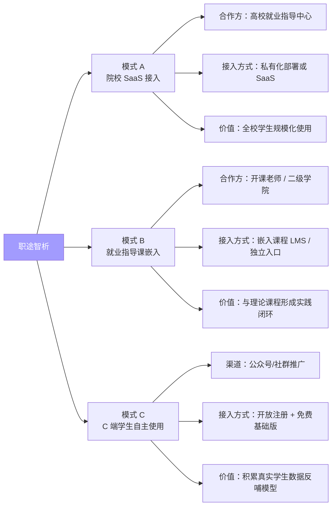

# 职途智析——基于AI的大学生职业规划智能体
## 项目详细方案

**第十五届中国大学生服务外包创新创业大赛 · A类 · 陕西明杉数据科技**

| 项目 | 内容 |
|------|------|
| 作品名称 | 职途智析——基于AI的大学生职业规划智能体 |
| 作品类别 | 应用类 |
| 命题方向 | 智能计算 |
| 团队名 | 不慌offer队 |
| 作者 | `[待填写]` |
| 指导老师 | 田纹龙 |
| 日期 | 2026 年 X 月 X 日 |

---

## 目录

- [第 0 章 摘要](#第-0-章-摘要)
- [第 1 章 项目背景与行业洞察](#第-1-章-项目背景与行业洞察)
- [第 2 章 目标用户与典型场景](#第-2-章-目标用户与典型场景)
- [第 3 章 产品方案与功能体系](#第-3-章-产品方案与功能体系)
- [第 4 章 系统架构设计](#第-4-章-系统架构设计)
- [第 5 章 数据工程与知识库构建](#第-5-章-数据工程与知识库构建)
- [第 6 章 AI Agent 协作体系](#第-6-章-ai-agent-协作体系)
- [第 7 章 核心算法](#第-7-章-核心算法)
- [第 8 章 可解释性与幻觉护栏](#第-8-章-可解释性与幻觉护栏)
- [第 9 章 命题要求对齐矩阵](#第-9-章-命题要求对齐矩阵)
- [第 10 章 测试与准确率验证](#第-10-章-测试与准确率验证)
- [第 11 章 应用场景与校园落地路径](#第-11-章-应用场景与校园落地路径)
- [第 12 章 风险识别与应对](#第-12-章-风险识别与应对)
- [第 13 章 里程碑与团队分工](#第-13-章-里程碑与团队分工)
- [第 14 章 附录](#第-14-章-附录)

---

## 第 0 章 摘要

"职途智析"是一款面向计算机类及信息化相关专业大学生的 AI 职业规划智能体，针对当前高校生涯规划中"自我认知模糊、职业信息不对称、外部指导缺位、规划落地性差"四大痛点提出系统化解决方案。

系统以 **150 万+条真实招聘数据**（智联招聘 2016-2025 约 100 万条 + 上市公司招聘大数据 2014-2026 约 50 万条）为基座，通过四阶段 ETL 管线与 O\*NET 经济指数校准，构建了覆盖 **45 个岗位节点、20 个岗位族、101 条转换边**的知识图谱。在此之上，基于 LangGraph 框架搭建 **Supervisor + 6 专家 Agent + 13 Coach Skill** 的多智能体协作体系，为学生提供从能力画像构建、人岗匹配诊断、职业发展报告到成长档案追踪的全链路服务。

技术上，系统采用 **四维加权人岗匹配算法**（职业技能 50% + 发展潜力 25% + 基础要求 15% + 职业素养 10%），通过 **图谱节点绑定 + evidence 引用**机制从架构层面阻断 LLM 幻觉，并以 **三段式技能补法地图**（learn / practice / both）为学生提供精准的缺口补法建议。产品已完成前后端全栈实现（React + FastAPI + SQLite + 通义千问 qwen-plus/qwen-max），**核心功能全链路可用；准确率评估框架已具备，正式抽样评测详见第 10 章**。

本方案从项目背景、产品设计、系统架构、数据工程、AI 能力、核心算法、可解释性、命题合规、测试验证、落地路径、风险管理、里程碑等十四个章节展开，力求在**商业可落地、技术深度、命题合规性**三方面给出完整答卷。

---

## 第 1 章 项目背景与行业洞察

### 1.1 命题背景

根据本次大赛 A 类命题原文的问题陈述，当前高校学生在职业规划过程中普遍面临四重困境：

1. **自我认知模糊，定位偏差**——多数学生选择专业时受分数、家长意愿等因素影响，缺乏对自身兴趣、能力、性格的深度剖析；易陷入"从众规划"误区，盲目跟风考研、考公、进大厂，忽视自身特质与职业的匹配度。

2. **职业信息不对称，认知片面**——对行业和岗位的了解多来自社交媒体、学长学姐的碎片化分享，缺乏系统的调研渠道；尤其对 AI、新能源等新兴领域的岗位技能要求、发展路径、职业风险认知不足，分不清"热门噱头"与"真实需求"。

3. **外部支持体系薄弱，指导缺位**——高校的生涯规划课程多以理论讲授、简历面试技巧为主，缺乏针对性的行业洞察和个性化指导；专业师资匮乏，部分指导老师脱离职场一线，难以提供贴合实际的建议。

4. **规划落地性差，缺乏实践衔接**——很多学生的职业规划停留在"纸面"，没有通过实习、项目实践等方式验证规划的合理性；面对行业迭代快、就业竞争激烈的现实，缺乏动态调整规划的能力。

### 1.2 现有解决方案的局限

当前市面上常见的大学生职业规划工具存在如下系统性不足：

| 解决方案类型 | 代表产品 | 主要局限 |
|------------|---------|---------|
| 通用求职平台 | Boss 直聘大学生版、实习僧 | 侧重岗位撮合，不做规划；JD 信息密度高但不做解读 |
| 简历优化工具 | 各类"AI 简历生成器" | AI 代写简历面试一问即穿帮，学生错失自我反思机会 |
| 在线职业测评 | MBTI、霍兰德、盖洛普 | 测评结果静态，与具体岗位要求脱节，可操作性弱 |
| 高校内置生涯课程 | 多数本科院校开设 | 理论为主，缺行业实时洞察，师资脱离一线 |
| 通用对话 LLM | ChatGPT、文心一言等 | 易产生幻觉（编造岗位名/公司/薪资）、无事实锚点 |

这些工具**各解决一半问题**，但没有一款能同时做到"**基于真实市场数据 + 个性化能力诊断 + 可操作成长路径**"三者闭环。

### 1.3 命题契合点

本项目对命题要求的响应策略，可归纳为"**数据实、分析准、建议落、反馈活**"四条主线：

- **数据实**——以 150 万+条真实招聘数据为底，拒绝基于通识的泛泛而谈
- **分析准**——四维加权人岗匹配 + embedding 语义对齐，避免标签匹配的粗放
- **建议落**——三段式补法地图区分"学概念 / 做项目 / 先学后做"，每条建议都有明确的执行路径
- **反馈活**——Delta 对比机制支撑动态调整，成长档案记录真实进展，规划不是"纸面文章"

---

## 第 2 章 目标用户与典型场景

### 2.1 用户画像

系统面向计算机类及信息化相关专业的在校大学生，具体可细分为三类典型用户：



### 2.2 典型使用场景

> 以下三个场景为系统运作示意，人名与数据用于说明完整产品流程，不代表真实用户案例。

#### 场景一：大二探索者李同学

**背景**：计算机科学专业大二，学了 Java 和数据结构，但对前端、后端、算法、数据都感兴趣，不知道该深入哪一条路线。

**使用路径**：
1. 上传简历 → 系统 LLM 提取出"Java 基础、LeetCode 100 题、学生会技术部经历"
2. 完成 SJT 情景测评 → 软技能画像出来：沟通 3、学习 4、创新 3、协作 4、抗压 3
3. 进入岗位图谱页 → 看到自己在图谱上的坐标，附近高亮"后端、全栈、数据工程"三个邻近岗位
4. 点击"后端工程师"节点 → 查看核心技能、晋升路径、AI 影响分析、典型项目
5. 生成初版发展报告 → 得到"后端方向最优，全栈为备选"的方向对齐分析

**价值交付**：10 分钟内从"不知道方向"到"有明确方向候选"，带具体论据，不是玄学测评。

#### 场景二：大三求职者王同学

**背景**：软件工程大三，确定走前端方向，投了 10 家公司简历都石沉大海，不知道问题在哪。

**使用路径**：
1. 粘贴某大厂前端工程师 JD → 系统四维诊断
2. 得到匹配分 62 分（职业技能 55、发展潜力 60、基础要求 85、职业素养 70）
3. 查看 top 缺口：缺 TypeScript 项目经验、Webpack 配置实战、跨端适配能力
4. 三段式补法地图告诉她：TypeScript 是 `both`（先学后做）、Webpack 是 `practice`（必须做项目）、跨端适配是 `practice`
5. 进入档案精修 → 发现已有的"XX 后台管理系统"项目描述是"参与前端开发"，被诊断为空洞（没数字、没负责、没成果）
6. 按提示补写为："独立实现 XX 后台 20 个页面，使用 React + TS，通过组件抽离将重复代码减少 40%"
7. 更新报告 → 匹配分升至 71，多了具体项目证据

**价值交付**：把"投递失败"这个模糊挫折拆解成"缺 TS / Webpack / 跨端 + 项目描述空洞"4 个具体可执行的动作。

#### 场景三：大四冲刺者张同学

**背景**：计算机大四，已收到 3 家公司面试邀请，面试后觉得自己表现不好，不知道如何复盘。

**使用路径**：
1. 成长档案-求职追踪 → 记录 3 家公司的面试轮次、职位、面试官问题
2. AI 教练（Coach Skill：interview-prep）协助做面试复盘——"哪一问你卡住了？是技术卡还是表达卡？"
3. 系统记录复盘反思 → 生成下次面试前的准备清单
4. 在报告中展示本周的成长 Delta：面试场次 +3、反思记录 +3、新增技能 +2

**价值交付**：把零散的面试经历沉淀成结构化的成长档案，下一次面试前直接调出复习。

---

## 第 3 章 产品方案与功能体系

### 3.1 核心闭环

系统围绕"**画像 → 匹配 → 报告 → 成长**"的核心闭环展开，各环节之间形成持续的反馈与迭代：



### 3.2 六大功能模块

| 模块 | 功能简介 | 命题对应 |
|------|---------|---------|
| **能力画像** | 简历上传（PDF/图片/粘贴）→ LLM 结构化提取 → SJT 情景测评 → 图谱定位 → 完整度/竞争力评分 | 任务 2（学生能力画像） |
| **岗位图谱** | 45 节点可视化探索 · 晋升路径（5 级）· 换岗路径 · 技能要求 · AI 影响分析 · 典型项目 | 任务 1（岗位画像+关联图谱） |
| **JD 诊断** | 粘贴真实 JD → 四维匹配评分 → 技能差距清单 → top 缺口高亮 → 历史对比 | 任务 3a（人岗匹配） |
| **发展报告** | AI 综合评价 + 方向对齐 + 三段式补法 + 分阶段行动计划 + AI 润色 + 一键导出 | 任务 3b/3c/3d（规划报告全套） |
| **成长档案** | 项目追踪 / 求职追踪 / 档案精修 三合一 + Delta 进度可视化 | 任务 3c（持续成长追踪） |
| **AI 教练** | 右侧常驻对话面板 · 13 个 Coach Skill · 自然语言交互 · 语音输入输出 | 贯穿全系统 |

### 3.3 设计哲学

产品设计坚持三条底线原则，这些原则同时也是**区别于市面同类产品的核心差异点**：

**① AI 辅助而非替代**——AI 只做诊断、分析、格式范本；学生必须用真实数据做决策和填空。档案精修模块的前端硬校验（数字 + 长度 + 动作动词）即是这一原则的直接落地。

**② 证据驱动而非凭空生成**——LLM 的关键结论性输出（方向对齐、岗位推荐）必须引用图谱中已存在的节点 ID 和学生实际数据作为 evidence，否则被后端直接过滤。这从架构层面阻断了 LLM 幻觉这一通用对话模型的根本缺陷。

**③ 诚实透明而非过度乐观**——报告中显式标注"无法判断的维度"、底部统计"N 个缺口中 X 个可通过项目补、(N-X) 个需系统学习"，不刻意美化结果。学生拿到的是真实的自己，而不是一张虚假的漂亮简历。

---

## 第 4 章 系统架构设计

### 4.1 整体架构

系统采用前后端分离的四层架构，各层职责清晰、可独立演进：



### 4.2 技术选型依据

| 层面 | 选型 | 关键理由 |
|------|------|---------|
| 前端框架 | React 18 + TypeScript + Vite | 组件化开发成熟、类型安全、HMR 快 |
| 图谱可视化 | @xyflow/react 12 | 原生支持拖拽/缩放、定制化强、无 d3 陡峭曲线 |
| 样式方案 | TailwindCSS + 自定义玻璃流派 | 原子类快速迭代、视觉统一 |
| 后端框架 | FastAPI + Pydantic | 类型驱动、自动文档、异步原生 |
| ORM | SQLAlchemy | 成熟稳定、支持 SQLite/PostgreSQL 切换 |
| 数据库 | SQLite（单机部署）| 零配置、便携；生产环境可无痛切 PG |
| AI 编排 | LangGraph + LangChain | 多智能体原生支持、状态图模式清晰 |
| 大模型 | 通义千问 qwen-plus / qwen-max | 中文理解领先、百炼平台稳定、成本可控 |
| 向量模型 | text-embedding-v4 | 通义系统一、与主模型共 API Key |
| 数据 ETL | DuckDB + Python + Pandas | 大文件本地分析效率高、无需搭 Spark |

### 4.3 目录结构

```
CareerPlanningAgent/
├── frontend/              # React 前端 (~72 个 tsx 组件)
│   └── src/
│       ├── pages/        # 主页面
│       ├── components/   # 按功能分组：profile / graph / report / growth-log / ...
│       ├── api/          # API 客户端模块
│       └── hooks/        # 自定义 Hook
├── backend/              # FastAPI 后端
│   ├── routers/          # 12 个 Router
│   ├── services/         # 13 个 Service
│   ├── models/           # DB 模型
│   └── app.py            # 入口
├── agent/                # AI Agent 层
│   ├── supervisor.py     # Supervisor 路由器
│   ├── agents/           # 6 个专家 Agent
│   ├── skills/           # 13 个 Coach Skill
│   └── tools/            # Agent 工具集
├── data/                 # 数据资产
│   ├── graph.json        # 岗位知识图谱
│   ├── skill_fill_path_tags.json  # 三段式补法标签
│   ├── sjt_templates.json         # SJT 测评题库
│   └── ...
├── etl/                  # ETL 管线（4 阶段）
├── scripts/              # 图谱构建/富化脚本（8+ 步）
└── docs/                 # 项目文档
```

---

## 第 5 章 数据工程与知识库构建

### 5.1 数据资产总览

系统的数据基础是 **150 万+条真实招聘数据**，配合 **O\*NET / Anthropic 经济指数**和 **developer-roadmap** 技能树构成多源融合知识库：

| 数据来源 | 规模 | 时间跨度 | 在管线中的作用 |
|---------|------|---------|---------------|
| 智联招聘数据库 | ~100 万条 | 2016-2025 | 主数据源 · 岗位分类 · 技能频率统计 · 薪资分布 |
| 上市公司招聘大数据 | ~50 万条 | 2014-2026 | 补充数据源 · 2019-2020 数据空白填补 · 行业分布信号 |
| 企业命题提供岗位数据 | 9,959 条 | 近期 | 补充验证语料 |
| O\*NET / Anthropic 经济指数 | 409 MB | 2025 最新 | 校准 AI 替代压力 · 人机协作杠杆系数 |
| developer-roadmap | 45+ 角色 | 2024 | 技能层级结构 · 学习路径骨架 |

### 5.2 ETL 管线（4 阶段）

原始 CSV 数据到最终可用的市场信号，经过 `etl/` 目录下的四个 ETL 脚本处理：



**阶段一（分类）**：基于 YAML 定义的 20 个岗位族关键词规则（如"AI/ML 匹配 [算法工程师、机器学习、大模型、LLM...] 排除 [销售、产品经理]"），使用 DuckDB 对海量 CSV 做高效分类；同时提取 AI 应用程度（tier1 核心 LLM/Transformer、tier2 应用 ML/DL、tier3 通用 AI）。输出两份 parquet 文件。

**阶段二（聚合）**：按 `(role_family, year)` 分组，计算年度指标：岗位数量、薪资 p25/p50/p75、AI 渗透率。同时按行业聚合得到每个岗位族的 top 雇主行业分布。输出两份 JSON。

**阶段三（市场信号生成）**：基于 2021-2024 年数据，为每个岗位族综合计算三个信号：需求趋势（增长/平稳/萎缩）、薪资动量（年均 CAGR）、AI 窗口（AI 应用比例变化）。合成为 "best / good / neutral / caution / no_data" 五档时机判断。输出 market_signals.json。

**阶段四（技能频率统计）**：从 2021-2024 年 JD 描述中提取关键词频率，按出现率划分 core（≥50%）/important（20-50%）/bonus（5-20%）三档，剔除 rare（<5%）。为岗位画像的 `skill_tiers` 字段提供数据支撑。

### 5.3 图谱构建（8 步富化）

ETL 管线输出的是时序与频率数据，还需通过 `scripts/` 目录下的 8 步富化流程才能生成最终的 `graph.json`。为便于整体追踪数据流，本节编号延续 5.2 节 ETL 管线的 ①-④ 步，图谱富化接续为 ⑤-⑫ 共 8 步：

```
⑤ 节点构建 (build_roadmap_graph.py)
   · 基于 ROLE_META 字典构建 45 个节点
   · 关联 O*NET SOC codes
   · 注入 salary_p50、替代压力、AI 杠杆系数等市场指标

⑥ 晋升路径生成 (gen_promotion_paths.py)
   · 为每个节点生成 L1-L5 职级标签
   · 示例：初级前端 → 前端工程师 → 高级前端 → 前端技术专家 → 前端架构师

⑦ 转换边生成 (regen_edges.py)
   · 三类边：related（换岗双向）、supplementary（技能依赖）、promotion（晋升）
   · 基于领域知识构建 101 条边

⑧ O*NET 校准 (融入 ROLE_META)
   · 利用 Anthropic 经济指数校准每个岗位的替代压力百分比
   · 示例：算法工程师 replacement_pressure=15%（核心研究不易替代）
   · 示例：前端工程师 replacement_pressure=48%（UI 代码生成能力强）

⑨ LLM 富化 (enrich_graph_strategic.py)
   · 调用 qwen-max，为每个节点生成 market_insight / ai_impact_narrative / 
     differentiation_advice / typical_employers / entry_barrier / career_ceiling / 
     project_recommendations 等战略字段

⑩ 软技能计算 (gen_soft_skills.py)
   · 基于 career_level、replacement_pressure、human_ai_leverage 计算五维软技能分
   · 维度：communication / learning / resilience / innovation / collaboration

⑪ 区分特征标注 (add_distinguishing_features.py)
   · distinguishing_features：这个岗位的人应该有什么特质
   · not_this_role_if：什么情况不适合这个岗位

⑫ 质量校验 (fix_graph_quality.py)
   · 跨域污染清洗（如把嵌入式技能从前端节点中移除）
   · skill_tiers 一致性校验
   · 缺失字段补全
```

### 5.4 最终图谱数据结构

每个岗位节点包含如下结构化字段（100% 覆盖率）：

```yaml
node_id: "frontend"                    # 唯一标识
label: "前端工程师"
role_family: "前端开发"
career_level: 2                        # 1-5 职级标尺
zone: "transition"                     # safe / leverage / transition / danger

# 市场指标
salary_p50: 22000
replacement_pressure: 48.0             # AI 替代压力 %
human_ai_leverage: 61.6                # 人机协作杠杆 %
onet_codes: ["15-1254"]

# 技能分层
must_skills: [React, Vue.js, TypeScript, CSS, Webpack, Next.js]
skill_tiers:
  core: [{name: React, freq: 0.72}, ...]
  important: [...]
  bonus: [...]

# 晋升路径
promotion_path:
  - {level: 1, title: "初级前端工程师"}
  - {level: 2, title: "前端工程师"}
  - {level: 3, title: "高级前端工程师"}
  - {level: 4, title: "前端技术专家"}
  - {level: 5, title: "前端架构师"}

# 软技能画像
soft_skills:
  communication: 2
  learning: 3
  resilience: 2
  innovation: 3
  collaboration: 2

# LLM 富化的叙事字段
market_insight: "前端岗位需求 2024 年相对平稳..."
ai_impact_narrative: "AI 生成 UI 代码能力突飞猛进，但交互设计、性能优化..."
differentiation_advice: "做一个真实产品..."
typical_employers: [阿里, 字节, 腾讯, ...]
project_recommendations:
  - {name: "...", difficulty: "...", why: "..."}
entry_barrier: "medium"
career_ceiling: "应届 22k，3 年资深 30-35k..."
distinguishing_features: [React/Vue 项目主导, 前端工程化, ...]
not_this_role_if: [后端 API 开发者偶尔写前端, ...]
```

---

## 第 6 章 AI Agent 协作体系

### 6.1 Supervisor 模式

本系统采用 **Supervisor Pattern** 作为多智能体协作架构，区别于单一 LLM 通过 System Prompt 切换身份的朴素做法：



### 6.2 六个专家 Agent 职责

| Agent | 职责范围 | 主要工具 |
|-------|---------|---------|
| **navigator** | 岗位图谱探索、路径规划 | search_nodes · get_promotion_path · compare_roles · find_transition_path |
| **profile** | 画像诊断、图谱定位、能力评估 | get_profile_summary · locate_on_graph · diagnose_gaps |
| **jd** | JD 解析、四维匹配诊断、技能差距分析 | diagnose_jd · extract_jd_requirements · compare_with_profile |
| **growth** | 项目进展追踪、面试记录、学习状态 | get_project_progress · get_interview_records · log_learning |
| **coach** | 综合教练对话（13 个 Skill） | 按场景选择 Skill（详见 6.4） |
| **search** | 实时岗位搜索、招聘信息获取 | web_search · fetch_job_postings |

### 6.3 三级意图识别机制

Supervisor 在路由到具体 Agent 之前，采用**三级分类**机制识别意图，在保证准确率的同时兼顾响应速度和成本控制：

**Tier 1 · 正则快判（毫秒级）**
处理高频确定性意图：
- **JD 文本检测**：长度 > 100 字符 + 包含 JD 关键词（岗位职责、任职要求、技能要求等）→ 直接路由到 jd_agent
- **简短确认**：正则匹配"好/可以/行/嗯/对/是/ok" → 路由到 coach_agent（继续上文）
- **方向困惑**：匹配"不知道/迷茫/该怎么办" → 路由到 coach_agent（走 direction-scaffold skill）

**Tier 2 · 语义路由（embedding 无 LLM 调用）**
对未在 Tier 1 命中的输入，使用预训练的意图分类器（基于 embedding 相似度匹配），无需调用 LLM，返回 `(agent_name, tool_hint)` 元组。

**Tier 3 · LLM 兜底分类**
仅当前两级都无法判断时，才调用 qwen-plus 做意图分类（temperature=0，max_tokens=10），返回 agent 名称。

**设计收益**：日常高频意图由前两级直接命中，仅复杂长句回退到 LLM 分类，**显著降低响应延迟和 LLM 调用成本**。

### 6.4 13 个 Coach Skill

Coach Agent 内部根据对话上下文自动选择 13 个专业 Skill 之一，实现"一个 Agent 承载多种教练场景"的效果：

| Skill 名称 | 适用场景 |
|-----------|---------|
| coach-greeting | 首次打招呼、会话破冰 |
| coach-direction-scaffold | 方向迷茫时的脚手架式引导 |
| coach-decision-socratic | 苏格拉底式决策辅导（考研还是就业？） |
| coach-project-planning | 项目规划与立项辅导 |
| coach-interview-prep | 面试准备与模拟 |
| coach-progress-report | 阶段性进展回顾 |
| coach-market-signal | 市场信号解读（哪个方向现在时机好？） |
| coach-resume-review | 简历内容评审 |
| coach-concern-direct | 直接回应学生顾虑 |
| coach-comparison-detox | "别人都去大厂我怎么办"类焦虑化解 |
| coach-emotional-support | 低落情绪支持 |
| coach-confirmation | 选择确认与意向锁定 |
| coach-request-deliver | 明确请求响应（如"给我一个两周学习计划"） |

### 6.5 工程实现要点

- **状态管理**：LangGraph 的状态图模式，每个 Agent 节点接收上一节点的输出状态
- **工具调用**：LangChain 的 ChatOpenAI 封装 + tool-calling 协议
- **流式响应**：SSE（Server-Sent Events）将 LLM 流式输出推到前端
- **会话持久化**：聊天消息存入 SQLite，支持多轮对话的上下文记忆

---

## 第 7 章 核心算法

### 7.1 四维人岗匹配算法

对齐命题要求的"4 个方面多维度能力分析"，本系统的匹配算法从**基础要求、职业技能、职业素养、发展潜力**四个维度独立评分，最后加权汇总：



**各维度评分规则（backend/services/matching_service.py）：**

| 维度 | 权重 | 评分公式 |
|------|-----|---------|
| **职业技能** | 50% | `Σ(技能匹配值 × 熟练度权重) / max_possible × 100`<br/>熟练度权重：advanced 1.0 / intermediate 0.75 / familiar 0.5 / beginner 0.25 |
| **发展潜力** | 25% | 项目数量（0 项=0，1 项=40，2 项=60，3+项=80）+ 获奖（每个 +10，上限 20）+ 学历层次（硕博 +10） |
| **基础要求** | 15% | `学历达标度(40%) + 专业相关度(35%) + 经验匹配(25%)`<br/>学历档：博士 4、硕士 3、本科 2、大专 1 |
| **职业素养** | 10% | 五维 SJT 分数与岗位要求的比值（clip 到 100） |

**语义匹配增强**：技能匹配不局限于字面相等，通过 `text-embedding-v4` 做语义级对齐，余弦相似度 ≥ 0.65 视为匹配。这解决了"简历写 Vue 但岗位要求前端框架"这类同义但不同词的表述差异问题。

### 7.2 图谱换岗成本算法

当学生在图谱中从岗位 A 转换到岗位 B 时，系统用四因子加权公式计算换岗成本：

```
raw_cost = 0.40 × skill_gap_cost        ← 技能差距
         + 0.25 × cross_family_penalty  ← 跨岗位族惩罚
         + 0.20 × seniority_cost        ← 资历差代价
         + 0.15 × danger_zone_penalty   ← 风险区系数

final_cost = raw_cost × direction_modifier
```

**方向修正矩阵（非对称）**：

| 换岗方向 | 修正系数 | 业务含义 |
|---------|---------|---------|
| tech → business | 0.85 | 技术转业务相对容易（行业知识积累） |
| business → tech | 1.40 | 业务转技术难度较大（技能壁垒） |
| service → tech | 1.80 | 服务类转技术最难（从零建技能） |
| tech ↔ design | 1.10 | 略高于对称（设计审美需积累） |

**设计说明**：这些系数是**工程经验值**，反映职业发展的一般规律（如技能单向可迁移性、经验壁垒）。后续可用真实换岗数据（领英/BOSS 等平台的职业流向）进行校准。

### 7.3 三段式技能补法分类算法

学生看到"缺 Docker、缺高并发、缺数据结构"时，如果把所有缺口塞进同一个补法框架，会导致时间分配错误——**数据结构**靠刷题最有效，**高并发**必须做项目才能掌握，**Docker** 需要先学概念再做项目巩固。

本系统为所有涉及的技能预标注了三类补法标签（存储在 `data/skill_fill_path_tags.json`）：

```yaml
learn:        # 系统学习型：靠课程/教材/刷题
  - 数据结构
  - 算法
  - 操作系统
  - 计算机网络
  - 编译原理

practice:     # 项目实践型：必须做项目才能掌握
  - 高并发
  - 分布式系统
  - 性能优化
  - 微服务架构
  - DDD 设计

both:         # 先学后做型：先理论再项目
  - Docker
  - Kubernetes
  - Git
  - CI/CD
  - Redis
```

当学生报告生成时，系统将其技能缺口清单逐条匹配到这三类标签，形成"**三段式补法地图**"，并在报告底部给出诚实统计："N 个缺口 · X 个可通过项目补 · (N-X) 个需系统学习"。

---

## 第 8 章 可解释性与幻觉护栏

LLM 的"一本正经地编造"（hallucination）是职业规划场景中最致命的问题——一旦系统推荐了一个不存在的岗位或虚假的薪资区间，学生做出的决策将建立在错误信息上。本系统采用**分级防御**策略：

### 8.1 Tier 1 护栏：node_id 硬过滤（用于关键结论性输出）

对于方向对齐分析、岗位推荐等**决定学生未来方向**的关键输出，要求 LLM 的每次响应必须引用 `graph.json` 中已存在的 `node_id`，否则被后端直接过滤：

```python
# backend/services/report/career_alignment.py  (L263-271)
node_map = {n.get("node_id"): n for n in graph_nodes if n.get("node_id")}
validated: list[dict] = []
for a in parsed.get("alignments", []):
    nid = a.get("node_id", "")
    if nid not in node_map:
        logger.warning("Career alignment: LLM invented node_id '%s', dropped", nid)
        continue
    validated.append(a)
```

这让"凭空编一个岗位名"在架构上不可能输出到用户面前。

### 8.2 Tier 2 护栏：evidence 字段强制引用

每条对齐结论、每条缺口诊断，LLM 必须同时输出 `evidence` 字段，引用学生具体数据：

```json
{
  "node_id": "backend",
  "alignment_score": 0.82,
  "evidence": "学生简历中的'秒杀系统'项目展现了对高并发场景的理解（QPS 从 300 → 1800）",
  "gap": "缺少分布式事务的实战经验"
}
```

学生读到的每一句 LLM 结论，都能溯源到自己简历/项目中的具体一句话。

### 8.3 Tier 3 护栏：prompt 层约束 + 抽检（软性输出）

对于 AI 教练对话、报告叙事润色等软性输出，采用较轻的护栏：
- **Prompt 层**：明确要求"不得生造未在 context 中出现的公司名/岗位名/薪资数字"
- **输出后抽检**：开发阶段对高频输出路径进行人工抽样核对

这种分级防御的好处是——**关键输出高成本强护栏，软性输出低成本轻护栏**，在鲁棒性与效率间取得平衡。

### 8.4 可解释性的具体呈现

除了防幻觉，报告页对每一项结论都提供**可追溯的推理链**：

- **方向对齐**：显示 evidence（学生哪个项目 / 哪个技能支撑了这一判断）
- **缺口分析**：显示 top 缺口的出现频率（如"React 在该岗位 78% 的 JD 中为 core 要求"）
- **三段式补法**：每个技能都标明属于 learn/practice/both 三类中的哪一类，原因是什么
- **不确定项**：显式列出"无法判断的维度"，不假装全知

---

## 第 9 章 命题要求对齐矩阵

本章逐条对齐命题官方要求，提供实现证据与代码位置，供评审快速核验：

### 9.1 任务 1 · 岗位要求画像与关联图谱

| 命题要求 | 达成情况 | 实现证据 |
|---------|---------|---------|
| 构建 **≥10 个**岗位画像 | ✅ **45 个**岗位画像 | `data/graph.json` 含 45 节点，覆盖前端、后端、全栈、移动、游戏、AI/ML、数据、系统、嵌入式、运维、安全、测试、产品、设计、管理等 20 个岗位族 |
| 画像含专业技能、证书、创新能力、学习能力等 | ✅ 7 大字段组 100% 覆盖 | `skill_tiers` / `must_skills` / `soft_skills`（5 维）/ `promotion_path`（5 级）/ `project_recommendations` / `ai_impact_narrative` / `market_indicators` |
| **垂直晋升路径** | ✅ 每节点 5 级晋升路径 | `promotion_path` 字段，示例：初级前端 → 前端工程师 → 高级前端 → 前端技术专家 → 前端架构师 |
| 至少 **5 个岗位**的换岗路径，每个 **≥2 条** | ✅ **101 条**转换边，全部 45 个岗位均有换岗路径 | `graph.json` `edges` 数组 · `backend/services/graph_service.py` 四因子换岗成本算法 |

### 9.2 任务 2 · 学生就业能力画像

| 命题要求 | 达成情况 | 实现证据 |
|---------|---------|---------|
| 简历上传或自行录入 | ✅ 支持 **PDF / 图片 / 文字粘贴**三种方式 | `backend/routers/profiles.py` 三种解析接口 · LLM（qwen-plus）自动结构化提取 |
| 大模型拆解学生能力 | ✅ qwen-plus 提取 + qwen-max 隐式技能推断 | `backend/services/profile/` 目录 · `_infer_implicit_skills_llm()` 推断隐含技能（如 C++ 网络项目 → STL、Linux socket） |
| 画像含专业技能、证书、创新能力、学习能力、抗压能力、沟通能力、实习能力等 | ✅ 硬技能 + 软技能五维 + 项目经历 + 教育背景 | 软技能维度（沟通/学习/抗压/创新/协作）通过 **SJT 情景测评**量化 · `data/sjt_templates.json` |
| 完整度、竞争力评分 | ✅ 画像完整度诊断 + 四维匹配评分 | 空洞项目检测（缺数字/缺成果/过短/只参与） + 四维加权综合分 |

### 9.3 任务 3 · 职业生涯发展报告

| 命题要求 | 达成情况 | 实现证据 |
|---------|---------|---------|
| **4 维度**人岗匹配分析 | ✅ 基础要求(15%) + 职业技能(50%) + 职业素养(10%) + 发展潜力(25%) | `backend/services/matching_service.py` L18-23 `_DIMENSION_WEIGHTS` |
| 关键技能匹配准确率 **≥80%** | 🟡 评估框架已具备 | 精确匹配 + embedding 语义匹配（阈值 0.65）+ 共现推断三路融合；抽样评估将于提交前完成（详见第 10 章） |
| 画像关键信息准确率 **>90%** | 🟡 评估框架已具备 | LLM 提取 + 隐式技能推断 + 人工可抽检；抽样评估同上 |
| 职业目标设定与路径规划 | ✅ 方向对齐分析 + 换岗路径 + 晋升阶梯 | 报告第 3 节 "方向对齐"（LLM + 图谱节点绑定）· 图谱显示晋升路径与换岗路径 |
| 行业发展趋势分析 | ✅ market_signals.json + industry_signals.json | 基于 150 万+条招聘数据聚合的年度需求趋势、薪资动量、AI 渗透率 |
| 分阶段行动计划 | ✅ 3 阶段计划：0-2 周 / 2-6 周 / 6-12 周 | `backend/services/report/action_plan.py` L199-213 |
| 评估周期与指标（动态调整）| ✅ Delta 对比机制 | 每份新报告与上一份对比，显示"进步 / 待提升 / 下一步" |
| 报告编辑、润色 | ✅ 手动编辑 + AI 润色 | `POST /reports/{id}/polish` 调用 `polish_narrative()` |
| 一键导出 | ✅ PDF 导出 | `window.print()` + `@media print` CSS |

### 9.4 通用技术要求

| 命题要求 | 达成情况 | 实现证据 |
|---------|---------|---------|
| 至少使用一个大模型 | ✅ 通义千问 qwen-plus / qwen-max **全流程覆盖** | 画像提取、SJT 生成、JD 诊断、方向对齐、报告叙事、教练对话、Delta 分析等全部核心功能 |
| 可操作性、可解释性 | ✅ 图谱节点绑定防幻觉 + evidence 字段引用 + 三段式补法地图 | 详见第 8 章"可解释性与幻觉护栏" |
| 界面友好、交互符合习惯 | ✅ 基于玻璃拟态风格的响应式设计 | React + TailwindCSS · 右侧常驻 AI 教练面板 · 图谱拖拽缩放 · 一键导出 |

---

## 第 10 章 测试与准确率验证

### 10.1 测试金字塔



- **单元测试（tests/）**：matching_service、jd_service、graph_service 等核心模块的输入输出行为覆盖
- **集成测试**：HTTP Router 层的端到端 API 测试（上传简历 → 生成报告全流程）
- **端到端脚本**：`test_e2e_coach_skill.py` 模拟完整对话流程

### 10.2 准确率评估方法

命题硬性要求**关键技能匹配准确率 ≥ 80%** 和**画像关键信息准确率 > 90%**。本系统的评估方法设计如下：

**关键技能匹配准确率评估：**

1. **测试集构造**：从上市公司招聘 CSV 中随机抽取 **50 条真实 JD**（覆盖 10 个岗位族，每族 5 条），人工标注"核心技能清单"作为金标准
2. **测试流程**：让系统解析每条 JD 的技能要求，与金标准对比
3. **准确率指标**：
   - 精确匹配准确率 = 金标准技能在系统输出中的命中率
   - 语义匹配增强后的准确率（启用 embedding 阈值 0.65）
4. **当前状态**：**🟡 评估框架已具备（精确匹配 + embedding 语义 + 共现推断三路融合）**，正式抽样测试将于最终提交前完成。

**画像关键信息准确率评估：**

1. **测试集构造**：收集 **20 份真实大学生简历**（格式多样：纯文本、PDF、截图）
2. **人工标注**：每份简历人工列出"必须被提取的关键字段"（姓名、专业、核心技能、项目经历、获奖等）
3. **测试流程**：系统自动提取后，与人工标注对比
4. **准确率指标**：
   - 字段完整度 = 必需字段提取成功率
   - 字段正确率 = 提取内容与原文一致性
5. **当前状态**：同上，评估框架已具备，正式测试待完成。

### 10.3 当前已完成的测试覆盖

- ✅ 单元测试：`tests/` 目录下对核心算法的 unit test 覆盖
- ✅ 端到端冒烟测试：从简历上传到报告导出的完整流程跑通
- ✅ 三级意图识别的路由准确率（手工构造 50 条输入，观察路由结果）
- 🟡 大规模准确率抽样（80% / 90% 两项命题硬指标）：待提交前完成

**承诺**：准确率评估的完整报告将作为附加材料在正式提交时提供，且所有测试集、脚本、标注数据均纳入仓库以便评审复现。

---

## 第 11 章 应用场景与校园落地路径

### 11.1 落地模式设计

系统提供三种可组合的落地模式，适应高校不同层级的需求：



### 11.2 校园试点方案（设计中）

本方案**尚未开展正式校园试点**。以下是基于当前项目成熟度设计的**pilot 方案**，可作为答辩后的下一步行动：

**阶段一 · 小范围试点（建议 4 周）**
- **目标对象**：1 所目标高校的 1 个学院 · 大三大四学生 50 人
- **接入方式**：免费注册 + 就业指导老师推荐
- **验证指标**：
  - 报告生成完成率（注册 → 完成首份报告的比例）
  - 学生自评改善率（使用前后的"方向清晰度"量表）
  - 老师采纳度（是否愿意在下学期正式推荐）

**阶段二 · 院级推广（建议 8 周）**
- 扩展至 2-3 个学院 · 200-500 名学生
- 增加就业指导老师的后台监看页面
- 收集真实使用数据反哺模型（匿名化）

**阶段三 · 全校接入（建议 16 周）**
- 私有化部署至校就业中心服务器
- 接入校内统一身份认证（CAS/OAuth）
- 形成"每学期一次规划 + 毕业前汇总"的固定流程

### 11.3 商业可持续性

- **成本结构**：主要成本为 LLM API 调用（通义千问按量计费），单次完整报告生成约 ¥0.5-1.5（基于典型输入规模与 qwen-plus/qwen-max 公开定价的估算）
- **定价参考**：高校 SaaS 模式 **¥10-30/人/年**（相当于一杯奶茶换一年的职业规划服务）——此为参考区间，实际定价需经高校渠道调研后确认
- **B 端扩展**：企业 HR 侧可做"候选人画像匹配"功能，校招季按岗位付费
- **数据飞轮**：真实学生数据（脱敏后）可进一步优化岗位图谱和匹配算法，形成正向循环

---

## 第 12 章 风险识别与应对

| 风险类别 | 具体风险 | 应对措施 |
|---------|---------|---------|
| **技术风险** | LLM API 调用超时或失败 | 多级重试（60s → 90s）+ 降级提示 + 关键接口缓存 |
| **技术风险** | LLM 输出幻觉（编造岗位/薪资） | 分级护栏：关键输出 node_id 硬过滤 + evidence 字段强制引用 + prompt 层约束 |
| **数据风险** | 原始招聘数据不含 2019-2020 年 | 用上市公司数据填补空白；数据质量在 `market_timeline` 中显式标注 full/gap/partial |
| **数据风险** | 岗位技能要求随市场变化快 | ETL 管线设计为可重跑；规划每季度一次全量刷新 |
| **合规风险** | 学生简历信息敏感 | SQLite 本地存储、不上传云端；正式部署时启用数据库加密 + HTTPS |
| **合规风险** | LLM 调用日志可能含 PII | 日志脱敏中间件（身份证号/手机号/邮箱自动遮蔽） |
| **产品风险** | 学生把 AI 建议当圣旨盲从 | 报告显式标注"AI 辅助决策 · 最终选择请结合自身"；档案精修强制学生填空不代写 |
| **用户冷启动** | 新用户缺乏画像数据时报告质量下降 | 引导式画像完善流程 + 基于通用数据的兜底报告 |

---

## 第 13 章 里程碑与团队分工

### 13.1 已完成里程碑

| 时间 | 里程碑 | 状态 |
|------|-------|-----|
| 2025-11 | 数据 ETL 管线建成，智联 + 上市公司数据完成清洗分类 | ✅ |
| 2025-12 | 45 节点岗位图谱完成构建 + LLM 富化 | ✅ |
| 2026-01 | 前后端基础框架搭建 · 核心 API 上线 | ✅ |
| 2026-02 | LangGraph 多智能体体系完成 + 6 Agent 接入 | ✅ |
| 2026-03 | 四维匹配算法 + JD 诊断 + 报告生成全链路打通 | ✅ |
| 2026-04 | 档案精修模块 + Delta 对比机制上线 | ✅ |
| 2026-04 | 三段式补法地图 + AI 教练 13 Skill 接入 | ✅ |
| 2026-04 | 文档与提交材料撰写 | 🔨 进行中 |

### 13.2 下一步路线

| 时间 | 计划 |
|------|-----|
| 2026-04 下旬 | 准确率抽样评估（50 条 JD + 20 份简历）+ 评估报告出具 |
| 2026-05 | 最终提交 + 答辩准备 |
| 2026-05 之后 | 若获奖：联系 1-2 所目标高校启动小范围试点 |

### 13.3 团队分工

`[待填写 - 包含每位成员的角色和负责模块]`

---

## 第 14 章 附录

### 14.1 主要 API 清单

本表列出核心业务接口，完整 OpenAPI 文档在后端启动后可访问 `http://localhost:8000/docs` 查看交互式 Swagger UI。

| 模块 | 方法 | 路径 | 说明 |
|------|------|------|------|
| **Auth** | POST | `/api/auth/register` | 注册 |
| **Auth** | POST | `/api/auth/login` | 登录 |
| **Auth** | GET | `/api/auth/me` | 当前用户 |
| **Profile** | POST | `/api/profiles` | 上传/更新画像 |
| **Profile** | GET | `/api/profiles/me` | 获取当前用户画像 |
| **Profile** | POST | `/api/profiles/sjt/generate` | 生成 SJT 测评题 |
| **Profile** | POST | `/api/profiles/sjt/submit` | 提交 SJT 答案 |
| **Profile** | PATCH | `/api/profiles/me/projects/refine` | 档案精修 |
| **Graph** | GET | `/api/graph/map` | 获取完整图谱 |
| **Graph** | GET | `/api/graph/nodes/{id}` | 单节点详情 |
| **Graph** | GET | `/api/graph/search` | 节点搜索 |
| **Graph** | POST | `/api/graph/career-goal` | 设置职业目标 |
| **JD** | POST | `/api/jd/diagnose` | 四维 JD 诊断 |
| **JD** | GET | `/api/jd/history` | 诊断历史 |
| **Report** | POST | `/api/reports/generate` | 生成新报告 |
| **Report** | GET | `/api/reports/{id}` | 获取报告 |
| **Report** | PATCH | `/api/reports/{id}` | 编辑报告 |
| **Report** | POST | `/api/reports/{id}/polish` | AI 润色 |
| **GrowthLog** | POST | `/api/growth-log/projects` | 新增项目记录 |
| **GrowthLog** | POST | `/api/growth-log/applications` | 新增求职记录 |
| **GrowthLog** | POST | `/api/growth-log/applications/{id}/debrief` | 面试复盘 |
| **Chat** | POST | `/api/chat/sessions` | 新建会话 |
| **Chat** | GET | `/api/chat/sessions/{id}/messages` | 会话消息 |

### 14.2 graph.json 节点样例

```json
{
  "node_id": "backend",
  "label": "后端工程师",
  "role_family": "后端开发",
  "career_level": 2,
  "zone": "leverage",
  "salary_p50": 25000,
  "replacement_pressure": 35.0,
  "human_ai_leverage": 68.5,
  "onet_codes": ["15-1252"],
  "must_skills": ["Java", "Spring Boot", "MySQL", "Redis", "Docker"],
  "skill_tiers": {
    "core": [
      {"name": "Java", "freq": 0.72},
      {"name": "MySQL", "freq": 0.68},
      {"name": "Spring Boot", "freq": 0.65}
    ],
    "important": [
      {"name": "Redis", "freq": 0.42},
      {"name": "Kafka", "freq": 0.28}
    ],
    "bonus": [
      {"name": "Kubernetes", "freq": 0.15}
    ]
  },
  "promotion_path": [
    {"level": 1, "title": "初级后端工程师"},
    {"level": 2, "title": "后端工程师"},
    {"level": 3, "title": "高级后端工程师"},
    {"level": 4, "title": "后端技术专家"},
    {"level": 5, "title": "后端架构师"}
  ],
  "soft_skills": {
    "communication": 3,
    "learning": 4,
    "resilience": 3,
    "innovation": 3,
    "collaboration": 3
  },
  "project_recommendations": [
    {
      "name": "高并发秒杀系统",
      "difficulty": "hard",
      "why": "涵盖缓存/限流/消息队列核心知识"
    }
  ],
  "market_insight": "...",
  "ai_impact_narrative": "...",
  "differentiation_advice": "...",
  "typical_employers": ["阿里", "字节", "腾讯", "美团", "京东"],
  "entry_barrier": "medium",
  "career_ceiling": "..."
}
```

### 14.3 部署说明

**开发环境启动：**

```bash
# 一键启动（推荐）
start.bat   # 按提示选 1 启动前后端

# 手动启动
python -m uvicorn backend.app:app --reload   # 后端 → http://localhost:8000
cd frontend && npm run dev                    # 前端 → http://localhost:5173
```

**环境变量（.env）：**

```dotenv
DASHSCOPE_API_KEY=sk-xxxxxxxxxxxx
LLM_MODEL=qwen-plus
EMBEDDING_MODEL=text-embedding-v4
```

**最低硬件要求：**

| 环境 | 要求 |
|------|------|
| 客户端 | 现代浏览器（Chrome / Edge / Firefox） |
| 服务端 | Python 3.12+ · Node.js 18+ · 8 GB 内存 |
| 操作系统 | Windows / macOS / Linux 均可 |

**数据准备：**

原始招聘 CSV 数据因体积较大（合计约 20 GB）不纳入仓库，中间产物 `classified.parquet`、`graph.json`、`market_signals.json` 等已纳入仓库 `data/` 目录，支持从图谱层开始的完整系统演示；如需重新执行 ETL，需获取原始 CSV 后置于 `E:/BaiduNetdiskDownload/` 下运行 `etl/01_classify*.py` 序列脚本。

---

## 结语

"职途智析"立足大学生职业规划的真实痛点，以 150 万+条真实招聘数据为基座，通过 4 阶段 ETL 管线与 8 步图谱富化构建了覆盖 45 个岗位、20 个岗位族的知识图谱；在此之上搭建 LangGraph 多智能体架构与四维人岗匹配算法，为学生提供从能力画像到发展报告的全链路智能规划服务。

系统坚持"AI 辅助而非替代"的设计理念——AI 负责诊断与分析，学生用真实数据做决策；坚持"证据驱动而非凭空生成"的技术原则——图谱节点绑定与 evidence 引用让每一条 LLM 输出都可追溯；坚持"诚实透明而非过度乐观"的产品底线——未测量的指标不虚报、无法判断的维度显式标注。

**我们相信，好的职业规划工具不是给学生一个漂亮的答案，而是帮他们更清晰地看到自己。**

> **职途智析——让每一份职业规划都有数据支撑、有证据可查、有路径可行。**
