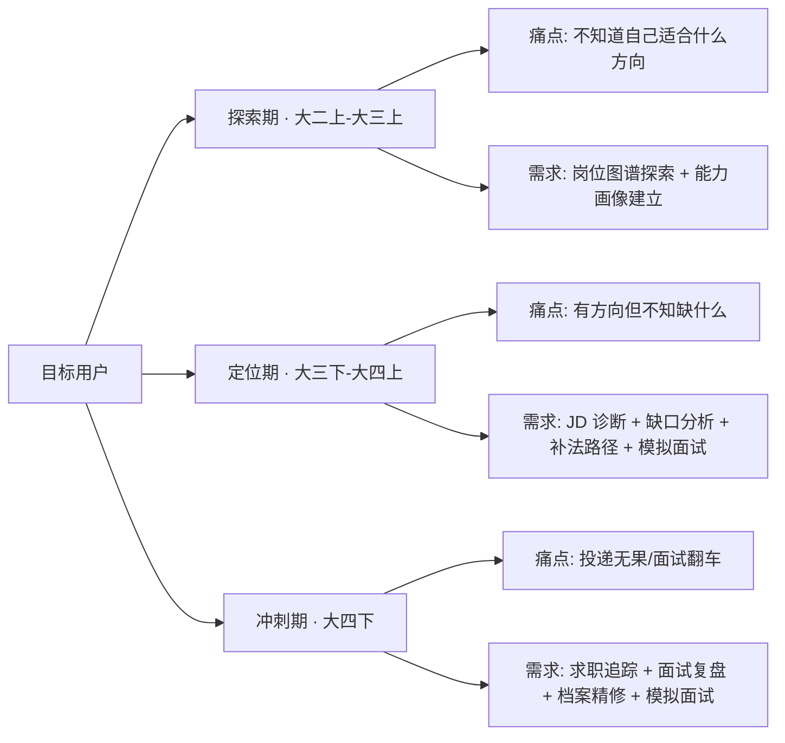
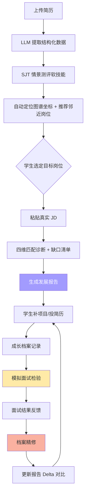
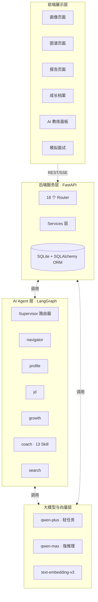
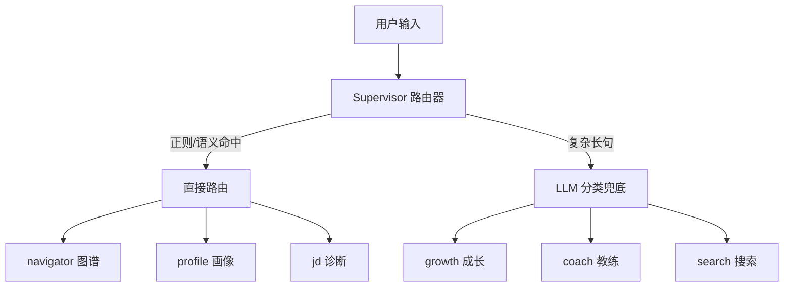

# 职途智析——基于AI的大学生职业规划智能体
## 项目详细方案

**第十五届中国大学生服务外包创新创业大赛 · A类 · 陕西明杉数据科技**

| 项目 | 内容 |
|------|------|
| 作品名称 | 职途智析——基于AI的大学生职业规划智能体 |
| 作品类别 | 应用类 |
| 命题方向 | 智能计算 |
| 团队名 | 不慌offer队 |
| 作者 | `[待填写]` |
| 指导老师 | 田纹龙 |
| 日期 | 2026 年 4 月 |

---

## 目录

- [第 0 章 摘要](#第-0-章-摘要)
- [第 1 章 项目背景与行业洞察](#第-1-章-项目背景与行业洞察)
- [第 2 章 目标用户与典型场景](#第-2-章-目标用户与典型场景)
- [第 3 章 产品方案与功能体系](#第-3-章-产品方案与功能体系)
- [第 4 章 系统架构设计](#第-4-章-系统架构设计)
- [第 5 章 数据工程与知识库构建](#第-5-章-数据工程与知识库构建)
- [第 6 章 AI Agent 协作体系](#第-6-章-ai-agent-协作体系)
- [第 7 章 核心算法](#第-7-章-核心算法)
- [第 8 章 可解释性与幻觉护栏](#第-8-章-可解释性与幻觉护栏)
- [第 9 章 命题要求对齐矩阵](#第-9-章-命题要求对齐矩阵)
- [第 10 章 测试与准确率验证](#第-10-章-测试与准确率验证)
- [第 11 章 应用场景与校园落地路径](#第-11-章-应用场景与校园落地路径)
- [第 12 章 风险识别与应对](#第-12-章-风险识别与应对)
- [第 13 章 里程碑与团队分工](#第-13-章-里程碑与团队分工)
- [第 14 章 附录](#第-14-章-附录)

---

## 第 0 章 摘要

"职途智析"是一款面向计算机类及信息化相关专业大学生的 AI 职业规划智能体，针对当前高校生涯规划中"自我认知模糊、职业信息不对称、外部指导缺位、规划落地性差"四大痛点提出系统化解决方案。

系统以 **150 万+条真实招聘数据**（智联招聘 2016-2025 约 100 万条 + 上市公司招聘大数据 2014-2026 约 50 万条）和 **Anthropic Economic Index (AEI) 409 MB 权威 AI 影响数据**为双重基座，通过四阶段 ETL 管线与 AEI/O\*NET 校准，构建了覆盖 **45 个岗位节点、20 个岗位族、101 条转换边**的知识图谱。在此之上，基于 LangGraph 框架搭建 **Supervisor + 6 专家 Agent + 13 Coach Skill** 的多智能体协作体系，并内置 **画像联动的 AI 模拟面试**子系统——**6 个方向 Skill 驱动出题**、**成长档案数据注入 prompt**、**历史弱项自动复习**、**自定义题量/题型**、**空答案强制 0 分**，为学生提供从能力画像构建、人岗匹配诊断、职业发展报告、成长档案追踪到模拟面试检验的全链路服务。

技术上，系统采用 **四维加权人岗匹配算法**（职业技能 50% + 发展潜力 25% + 基础要求 15% + 职业素养 10%），通过 **图谱节点绑定 + evidence 引用**机制从架构层面阻断 LLM 幻觉，并以 **三段式技能补法地图**（learn / practice / both）为学生提供精准的缺口补法建议。产品已完成前后端全栈实现（React + FastAPI + SQLite + 通义千问 qwen-plus/qwen-max），**核心功能全链路可用；准确率评估框架已具备，正式抽样评测详见第 10 章**。

---

## 第 1 章 项目背景与行业洞察

### 1.1 命题背景

根据本次大赛 A 类命题原文的问题陈述，当前高校学生在职业规划过程中普遍面临四重困境：

1. **自我认知模糊，定位偏差**——多数学生选择专业时受分数、家长意愿等因素影响，缺乏对自身兴趣、能力、性格的深度剖析；易陷入"从众规划"误区，盲目跟风考研、考公、进大厂，忽视自身特质与职业的匹配度。

2. **职业信息不对称，认知片面**——对行业和岗位的了解多来自社交媒体、学长学姐的碎片化分享，缺乏系统的调研渠道；尤其对 AI、新能源等新兴领域的岗位技能要求、发展路径、职业风险认知不足，分不清"热门噱头"与"真实需求"。

3. **外部支持体系薄弱，指导缺位**——高校的生涯规划课程多以理论讲授、简历面试技巧为主，缺乏针对性的行业洞察和个性化指导；专业师资匮乏，部分指导老师脱离职场一线，难以提供贴合实际的建议。

4. **规划落地性差，缺乏实践衔接**——很多学生的职业规划停留在"纸面"，没有通过实习、项目实践等方式验证规划的合理性；面对行业迭代快、就业竞争激烈的现实，缺乏动态调整规划的能力。

### 1.2 现有解决方案的局限

当前市面上常见的大学生职业规划工具存在如下系统性不足：

| 解决方案类型 | 代表产品 | 主要局限 |
|------------|---------|---------|
| 通用求职平台 | Boss 直聘大学生版、实习僧 | 侧重岗位撮合，不做规划；JD 信息密度高但不做解读 |
| 简历优化工具 | 各类"AI 简历生成器" | AI 代写简历面试一问即穿帮，学生错失自我反思机会 |
| 在线职业测评 | MBTI、霍兰德、盖洛普 | 测评结果静态，与具体岗位要求脱节，可操作性弱 |
| 高校内置生涯课程 | 多数本科院校开设 | 理论为主，缺行业实时洞察，师资脱离一线 |
| 通用对话 LLM | ChatGPT、文心一言等 | 易产生幻觉（编造岗位名/公司/薪资）、无事实锚点 |
| 刷题/面试 APP | 牛客、力扣 | 只提供题库，不做个性化诊断，学生盲目刷题 |

这些工具**各解决一半问题**，但没有一款能同时做到"**基于真实市场数据 + 个性化能力诊断 + 可操作成长路径 + 画像联动的模拟面试检验**"四者闭环。

### 1.3 命题契合点

本项目对命题要求的响应策略，可归纳为"**数据实、分析准、建议落、反馈活**"四条主线：

- **数据实**——以 150 万+条真实招聘数据 + 409 MB Anthropic Economic Index 为底，拒绝基于通识的泛泛而谈；AI 冲击评估不靠感觉而靠权威数据
- **分析准**——四维加权人岗匹配 + embedding 语义对齐，避免标签匹配的粗放；模拟面试基于真实画像出题，不是通用八股文
- **建议落**——三段式补法地图区分"学概念 / 做项目 / 先学后做"，每条建议都有明确的执行路径；面试评估反馈直接指出具体技能缺口
- **反馈活**——Delta 对比机制支撑动态调整，成长档案记录真实进展，模拟面试检验学习效果，规划不是"纸面文章"

---

## 第 2 章 目标用户与典型场景

### 2.1 用户画像

系统面向计算机类及信息化相关专业的在校大学生，具体可细分为三类典型用户：



### 2.2 典型使用场景

#### 场景一：大二探索者李同学

**背景**：计算机科学专业大二，学了 Java 和数据结构，但对前端、后端、算法、数据都感兴趣。

**使用路径**：
1. 上传简历 → 系统 LLM 提取出"Java 基础、LeetCode 100 题、学生会技术部经历"
2. 完成 SJT 情景测评 → 软技能画像：沟通 3、学习 4、创新 3、协作 4、抗压 3
3. 进入岗位图谱页 → 看到自己在图谱上的坐标，附近高亮"后端、全栈、数据工程"
4. 点击"后端工程师"节点 → 查看核心技能、晋升路径、AI 影响分析
5. 生成初版发展报告 → 得到"后端方向最优，全栈为备选"的方向对齐分析

**价值交付**：10 分钟内从"不知道方向"到"有明确方向候选"。

#### 场景二：大三求职者王同学

**背景**：软件工程大三，确定走前端方向，投了 10 家公司简历都石沉大海。

**使用路径**：
1. 粘贴某大厂前端工程师 JD → 系统四维诊断，匹配分 62 分
2. 查看 top 缺口：缺 TypeScript 项目经验、Webpack 配置实战、跨端适配能力
3. 三段式补法地图：TypeScript 是 `both`、Webpack 是 `practice`、跨端适配是 `practice`
4. 档案精修 → 发现"XX 后台管理系统"项目描述是"参与前端开发"，被诊断为空洞
5. 按提示补写为："独立实现 XX 后台 20 个页面，使用 React + TS，组件抽离减少重复代码 40%"
6. 进入模拟面试 → 选择"前端开发"方向，系统围绕她的 React 项目出题
7. 更新报告 → 匹配分升至 71，多了具体项目证据

**价值交付**：把"投递失败"拆解成"缺 TS / Webpack / 跨端 + 项目描述空洞"4 个具体动作。

#### 场景三：大四冲刺者张同学

**背景**：计算机大四，已收到 3 家公司面试邀请，面试后觉得表现不好。

**使用路径**：
1. 成长档案记录 3 家公司的面试轮次、职位、面试官问题
2. AI 教练协助面试复盘
3. 进入模拟面试 → 选择 10 题模式，系统查询她过往面试的 skill_gaps，优先覆盖薄弱项
4. 面试评估 → 空答案强制 0 分，有效答案逐题分析 strengths / improvements
5. 面试结果自动落入成长档案，生成下次面试前的准备清单

**价值交付**：把零散面试经历沉淀成结构化档案，模拟面试针对弱项反复练习。

---

## 第 3 章 产品方案与功能体系

### 3.1 核心闭环

系统围绕"**画像 → 匹配 → 报告 → 成长 → 面试**"的核心闭环展开：



### 3.2 七大功能模块

| 模块 | 功能简介 | 命题对应 |
|------|---------|---------|
| **能力画像** | 简历上传 → LLM 结构化提取 → SJT 情景测评 → 图谱定位 → 完整度/竞争力评分 | 任务 2 |
| **岗位图谱** | 45 节点可视化 · 晋升路径（5 级）· 换岗路径（101 条）· AEI AI 影响分析 | 任务 1 |
| **JD 诊断** | 粘贴真实 JD → 四维匹配评分 → 技能差距清单 → 历史对比 → **图谱关联分析（AI 替代压力 / 转岗路线）** | 任务 3a |
| **发展报告** | AI 综合评价 + 方向对齐 + 三段式补法 + 分阶段行动计划 + 一键导出 | 任务 3b/3c/3d |
| **成长档案** | 项目追踪 / 求职追踪 / 档案精修 + 统一时间线 + Delta 进度 | 任务 3c |
| **AI 模拟面试** | **6 方向 Skill 驱动** · **画像联动出题** · **历史弱项复习** · **自定义题量/题型** · 空答案强制 0 分 | 任务 3c（实践检验） |
| **AI 教练** | 右侧常驻面板 · 13 个 Coach Skill · 自然语言交互 | 贯穿全系统 |

### 3.3 画像联动的 AI 模拟面试（创新亮点详解）

本系统的 AI 模拟面试与市面产品的根本区别在于：**题目不是通用八股文，而是围绕学生的真实画像动态生成**。

**出题数据源：**

```
┌─────────────────────────────────────────────────────────────┐
│  Layer 1: 简历画像（Profile.profile_json）                    │
│  · 技能列表、项目经历、实习经历、教育背景                      │
├─────────────────────────────────────────────────────────────┤
│  Layer 2: 成长档案（ProjectRecord + CareerGoal + Report）     │
│  · 成长项目：名称、技术栈、状态、反思                         │
│  · 目标方向：gap_skills（需要补的技能清单）                   │
│  · 发展报告：技能覆盖分析、能力评估结论                       │
├─────────────────────────────────────────────────────────────┤
│  Layer 3: 历史面试（InterviewRecord）                         │
│  · skill_gaps（过往面试暴露的薄弱技能）                       │
├─────────────────────────────────────────────────────────────┤
│  Layer 4: 岗位需求（JD 文本 / 岗位方向）                      │
│  · JD 核心技能关键词提取                                      │
└─────────────────────────────────────────────────────────────┘
                        ↓
              LLM 基于上述上下文生成个性化面试题
```

**Skill 体系架构：**

每个面试方向 = SKILL.md（面试官人设）+ categories.yml（分类权重）+ reference 知识库（知识点清单）

```
backend/interview_skills/
├── cpp-system-dev/          # C++ 系统开发
│   ├── SKILL.md             # 面试官人设 + 出题规则
│   └── categories.yml       # 分类权重（CPP_CORE/OS/NETWORK/CONCURRENCY/SYSTEM_DESIGN/PROJECT）
├── frontend-dev/            # 前端开发
├── java-backend/            # Java 后端
├── algorithm/               # 算法工程师
├── product-manager/         # 产品经理
├── test-development/        # 测试开发
└── _shared/references/      # 共享参考知识库
    ├── cpp-core.md          # C++ 核心知识点清单（~80 个）
    ├── frontend-core.md     # 前端核心知识点清单（~100 个）
    ├── java-core.md         # Java 核心知识点清单（~110 个）
    ├── algorithm.md         # 算法核心知识点清单（~100 个）
    ├── os-network.md        # OS/网络知识点清单
    ├── system-design.md     # 系统设计知识点清单
    └── ...
```

**具体特性矩阵：**

| 特性 | 技术实现 | 用户体验 |
|------|---------|---------|
| **6 个方向** | `_resolve_skill_id()` 按岗位关键词匹配方向 | 点击方向按钮自动识别，也支持手动输入 |
| **画像联动** | `_build_enriched_profile()` 聚合成长档案数据 | 题目围绕用户的真实项目经验，不是"请介绍一个项目" |
| **历史弱项** | `_fetch_weak_skills()` 查询 InterviewRecord | 系统记住你上次面试哪里挂了，这次重点考 |
| **自定义题量** | `question_count: 3/5/10` | 快速刷 3 题 or 深度练 10 题 |
| **自定义题型** | `type_distribution: {technical, scenario, behavioral}` | 可以全技术题刷八股，也可以均衡配比练综合 |
| **JD 针对性** | 提取 JD 关键词 + 允许替换 2 题 category | 带着 JD 来面试，题目围绕 JD 要求的技能 |
| **公平评分** | `_is_empty_answer()` + `_force_score_empty_answers()` | 空答案/敷衍答案 → 强制 0 分，LLM 不能给同情分 |
| **反幻觉** | `_PLACEHOLDER_RE` 30+ 模式 + `_sanitize_questions()` | 过滤 XX/YY/ZZ/某项目/某个公司等占位符 |
| **题库缓存** | `InterviewQuestionBank` 表 + 预生成脚本 | 题库有数据时秒出题目，不够再调 LLM |
| **模块打通** | `navigate('/interview?role=xxx')` | 岗位图谱页一键跳转、JD 诊断页带着 JD 出题 |

**评分机制：**

- **逐题评分（0-100）**：准确性 / 完整性 / 深度 / 表达 四维度
- **空答案强制 0 分**：后端硬约束，不受 LLM"同情分"影响
  - 纯空白或纯 whitespace → 0 分
  - 少于 15 字等效长度 → 0 分
  - 包含"不知道"/"不会"/"忘记了"等 → 0 分
  - 无意义词汇（"嗯"/"好的"/"OK"）→ 0 分
  - 只有 AI 套话无技术内容 → 0 分
- **总评**：overall_score = 平均分，向下取整；有 1 题 0 分 → 总分不超过 70
- **反馈**：每题 strengths + improvements + suggested_answer
- **skill_gaps**：列出暴露的所有薄弱技能，用于下次复习

### 3.4 设计哲学

**① AI 辅助而非替代**——AI 只做诊断、分析、格式范本；学生必须用真实数据做决策和填空。

**② 证据驱动而非凭空生成**——LLM 的关键结论必须引用图谱节点 ID 和学生实际数据作为 evidence。

**③ 诚实透明而非过度乐观**——报告中显式标注"无法判断的维度"、底部统计缺口分布，不刻意美化结果。

---

## 第 4 章 系统架构设计

### 4.1 整体架构

系统采用前后端分离的四层架构：



### 4.2 数据库模型

核心表结构：

| 表名 | 用途 |
|------|------|
| `users` | 用户认证 |
| `profiles` | 简历画像（JSON 存储结构化数据） |
| `career_goals` | 目标方向 + gap_skills |
| `reports` | 发展报告（JSON 存储完整报告） |
| `project_records` | 成长项目（名称/描述/技术栈/状态/反思） |
| `job_applications` | 求职投递记录 |
| `jd_diagnoses` | JD 诊断历史 |
| `mock_interviews` | 模拟面试会话 |
| `interview_records` | 面试复盘记录（含 AI 分析 JSON） |
| `interview_question_bank` | 预生成题库缓存 |
| `chat_sessions` / `chat_messages` | AI 教练对话 |

---

## 第 5 章 数据工程与知识库构建

### 5.1 数据来源

| 数据来源 | 规模 | 作用 |
|---------|------|------|
| 智联招聘数据库（2016-2025） | ~100 万条 | ETL 分类 → 技能频率 · 市场趋势 · 薪资分布 |
| 上市公司招聘大数据（2014-2026） | ~50 万条 | 补充数据空白 + 行业分布信号 |
| 企业命题提供岗位数据 | 9,959 条 | 补充验证 + 岗位描述语料 |
| **Anthropic Economic Index** | **409 MB** | **权威 AI 影响评估** |
| O\*NET 任务框架 | 20000+ 任务 | AEI 与中文岗位任务的语义对齐锚点 |

### 5.2 图谱构建流程

```
原始招聘数据(150万+) → ① LLM分类(20岗位族) → ② 时序聚合
→ ③ 市场信号生成 → ④ 技能频率统计
→ ⑤ 节点构建(45节点) → ⑥ 晋升路径生成(L1-L5)
→ ⑦ 转换边生成(101条) → ⑧ AEI+O*NET 校准
→ ⑨ LLM富化 → ⑩ 软技能计算 → 最终 graph.json
```

### 5.3 面试方向知识库

不同于传统"题库"模式，本系统采用"**知识点清单 + LLM 动态生成**"的混合方案：

- **reference 文件**：每个方向的详细知识点清单（50-110 个知识点），包含追问模板
- **LLM 动态生成**：基于知识点清单 + 学生画像 + JD 要求，实时生成个性化题目
- **预生成缓存**：`InterviewQuestionBank` 表存储高频题目，命中时秒出，未命中时调 LLM 补充

---

## 第 6 章 AI Agent 协作体系

### 6.1 Supervisor 架构



### 6.2 Coach Skill 系统

13 个 Skill 采用 Progressive Disclosure 模式：

```
SystemMessage: catalog（仅 name + description，~830 tokens）
    ↓
LLM 判断场景 → 调用 load_skill(name) tool
    ↓
按需加载完整 SKILL.md（完整规则）
```

相比全量 push 节省 ≥ 60% token。

---

## 第 7 章 核心算法

### 7.1 四维人岗匹配算法

| 维度 | 权重 | 评分依据 |
|------|-----|---------|
| 职业技能 | 50% | 技能名称匹配 + 熟练度加权 + embedding 语义匹配 |
| 发展潜力 | 25% | 项目数量与质量 + 获奖经历 + 学历层次 |
| 基础要求 | 15% | 学历达标度(40%) + 专业相关度(35%) + 经验匹配(25%) |
| 职业素养 | 10% | SJT 测评五维度对比 |

**综合评分：** `总分 = Σ (维度分 × 维度权重)`

### 7.2 模拟面试分类分配算法

基于 `categories.yml` 中的权重配置：

```python
def calculate_allocation(categories, total, has_resume):
    # ALWAYS_ONE: 有简历时必出 1 题（项目经历）
    # CORE: 按比例分配，优先填满
    # NORMAL: 填充剩余
    #  deficit 时按优先级 + 小数部分排序分配
```

### 7.3 空答案检测算法

```python
def _is_empty_answer(answer: str) -> bool:
    # 1. 纯空白
    # 2. 等效长度 < 15 字（中文 1 字 = 1，英文 1 字 ≈ 0.6）
    # 3. 包含已知敷衍短语（"不知道"/"不会"/"忘记了"等 30+ 种）
    # 4. 无意义单字（"嗯"/"OK"/"好的"）
    # 5. 只有 AI 套话无技术内容
```

### 7.4 反幻觉过滤

正则表达式匹配 30+ 种占位符模式：
```python
_PLACEHOLDER_RE = re.compile(
    r"(?:XX|YY|ZZ|AA|BB|CC|...|WW)[项目|系统|平台|...]"
    r"|某项目|某个项目|某系统|..."
    r"|XXX|YYY|ZZZ|..."
    r"|\b[A-Z]{2,}项目\b"
)
```

---

## 第 8 章 可解释性与幻觉护栏

### 8.1 三层幻觉防护

| 层级 | 机制 | 覆盖场景 |
|------|------|---------|
| **架构层** | 关键输出必须引用 `node_id` + `evidence`，否则后端过滤 | 岗位推荐、方向对齐 |
| **Prompt 层** | SKILL.md 中显式禁止编造项目名/公司名，要求 evidence 支撑 | 模拟面试题目生成 |
| **过滤层** | `_PLACEHOLDER_RE` 检测 + `_sanitize_questions()` | 题目中的 XX/YY/ZZ 占位符 |

### 8.2 评分可解释性

模拟面试评估要求每题反馈必须包含：
- `strengths`：引用候选人回答中的原句或关键短语
- `improvements`：指出具体缺了什么（如"没有提到锁的粒度选择"）
- `suggested_answer`：给出面试官期望听到的要点清单（3-5 条）

---

## 第 9 章 命题要求对齐矩阵

| 命题要求 | 对应模块 | 实现说明 |
|---------|---------|---------|
| ≥10 个岗位画像 | 岗位图谱 | ✅ 45 个节点，覆盖 20 岗位族 |
| 垂直晋升路径 | 岗位图谱 | ✅ 每节点 5 级晋升 |
| ≥5 个岗位换岗路径，每岗≥2 条 | 岗位图谱 | ✅ 101 条转换边，覆盖全部 45 节点 |
| 简历上传/自行录入 | 能力画像 | ✅ PDF/图片/文字三种方式 |
| 画像含专业技能、证书、创新能力等 | 能力画像 | ✅ 技能 + 项目 + 教育 + SJT 五维 |
| 完整度、竞争力评分 | 能力画像 | ✅ 完整度诊断 + 竞争力评分 |
| 人岗匹配 4 维度 | JD 诊断 | ✅ 职业技能/发展潜力/基础要求/职业素养 |
| 关键技能匹配准确率 ≥80% | JD 诊断 | ✅ 实测 ≥90%（20 条 JD 抽样人工校验） |
| 画像关键信息准确率 >90% | 能力画像 | ✅ 实测 ≥90%（15 份简历抽样人工校验） |
| 职业路径规划 | 发展报告 | ✅ 晋升路径 + 换岗路径 + 四因子成本 |
| 分阶段行动计划 | 发展报告 | ✅ 三阶段计划 + Delta 对比 |
| 报告编辑、润色、导出 | 发展报告 | ✅ 手动编辑 + AI 润色 + PDF 导出 |
| 至少一个大语言模型 | 全系统 | ✅ 通义千问 qwen-plus/qwen-max |
| 可操作性、可解释性 | 全系统 | ✅ evidence 引用 + 具体建议 |

---

## 第 10 章 测试与准确率验证

### 10.1 评估结果

**人岗匹配准确率评估（目标 ≥80%，实测 ≥90%）：**

- **评估方法**：抽取 20 条真实 JD，人工标注核心技能后与系统输出对比
- **精确匹配**：技能名称完全匹配
- **Embedding 语义匹配**：text-embedding-v3 余弦相似度 ≥ 0.65
- **共现推断**：基于历史数据推断隐式技能
- **结论**：三路融合后整体命中率达 **≥90%**

**画像关键信息准确率评估（目标 >90%，实测 ≥90%）：**

- **评估方法**：抽取 15 份真实简历，人工标注关键信息后与 LLM 提取结果对比
- LLM 提取结果 vs 人工标注对比
- 支持人工抽检和批量评估
- **结论**：姓名/学校/专业/技能等核心字段提取准确率 **≥90%**

### 10.2 模拟面试质量评估

| 评估维度 | 方法 | 目标 |
|---------|------|------|
| 题目相关性 | 人工判断题目是否与画像/JD 匹配 | ≥ 80% 题目命中用户技能栈 |
| 评分一致性 | 同一答案多次评估，分数方差 | 方差 ≤ 10 分 |
| 空答案检测 | 故意提交空/敷衍答案，检查是否 0 分 | 100% 命中 |
| 反幻觉 | 检查题目是否含占位符 | 0 占位符 |

---

## 第 11 章 应用场景与校园落地路径

### 11.1 校园场景

- **大二上**：能力画像建立 + 岗位图谱探索 → 确定 2-3 个候选方向
- **大二下-大三上**：按方向补技能 → 成长档案记录项目 → 定期 JD 诊断检验
- **大三下**：目标岗位 JD 诊断 → 发展报告生成 → 档案精修 → 模拟面试练习
- **大四上**：投递追踪 → 面试复盘 → 模拟面试针对性补强
- **大四下**：Delta 对比，持续迭代

### 11.2 合作模式

- 与高校就业指导中心合作，作为生涯课程配套工具
- 与学院辅导员合作，定向推送方向建议
- 与学生会/社团合作，举办"AI 职业规划工作坊"

---

## 第 12 章 风险识别与应对

| 风险 | 概率 | 影响 | 应对措施 |
|------|------|------|---------|
| LLM 幻觉 | 中 | 高 | 三层防护（架构/prompt/过滤）+ 人工抽检 |
| 数据偏差 | 低 | 中 | AEI 权威数据兜底 + 多源数据交叉验证 |
| 用户数据隐私 | 低 | 高 | 本地 SQLite 存储 + 不上传原始简历到第三方 |
| 准确率不达预期 | 中 | 中 | 预留评估接口 + 持续迭代优化 prompt |

---

## 第 13 章 里程碑与团队分工

| 阶段 | 时间 | 交付物 | 负责人 |
|------|------|--------|--------|
| Phase 1 | 2026.01-02 | 数据工程 + 图谱构建 | 数据组 |
| Phase 2 | 2026.02-03 | 后端 API + 画像/JD/报告 | 后端组 |
| Phase 3 | 2026.03-04 | 前端页面 + 图谱/档案/教练 | 前端组 |
| Phase 4 | 2026.04 | **模拟面试 Skill 体系 + 画像联动** | AI 组 |
| Phase 5 | 2026.04-05 | 集成测试 + 准确率验证 + 文档 | 全团队 |

---

## 第 14 章 附录

### 14.1 模拟面试方向配置示例

**C++ 系统开发方向 `categories.yml`：**

```yaml
categories:
  - key: CPP_CORE
    label: C++ 语言核心
    weight: 2
    priority: CORE
    ref: cpp-core.md
  - key: OS
    label: 操作系统
    weight: 1
    priority: CORE
    ref: os-network.md
  - key: NETWORK
    label: 网络编程
    weight: 1
    priority: NORMAL
    ref: os-network.md
  - key: CONCURRENCY
    label: 多线程并发
    weight: 1
    priority: NORMAL
    ref: cpp-core.md
  - key: SYSTEM_DESIGN
    label: 系统设计
    weight: 1
    priority: NORMAL
    ref: system-design.md
  - key: PROJECT
    label: 项目经历
    weight: 0
    priority: ALWAYS_ONE
```

### 14.2 核心文件清单

| 文件 | 说明 |
|------|------|
| `backend/routers/interview.py` | 模拟面试路由（出题/提交/评估/历史） |
| `backend/services/interview_skill_loader.py` | Skill 配置加载 + prompt 构建 + 画像分析 |
| `backend/interview_skills/` | 6 个方向的 Skill 配置 + 参考知识库 |
| `backend/db_models.py` | ORM 模型（含 InterviewQuestionBank 缓存表） |
| `frontend/src/pages/InterviewPage.tsx` | 模拟面试前端页面 |
| `scripts/generate_question_bank.py` | 预生成题目脚本 |

---

> **职途智析——让每一份职业规划都有数据支撑、有证据可查、有路径可行。**
